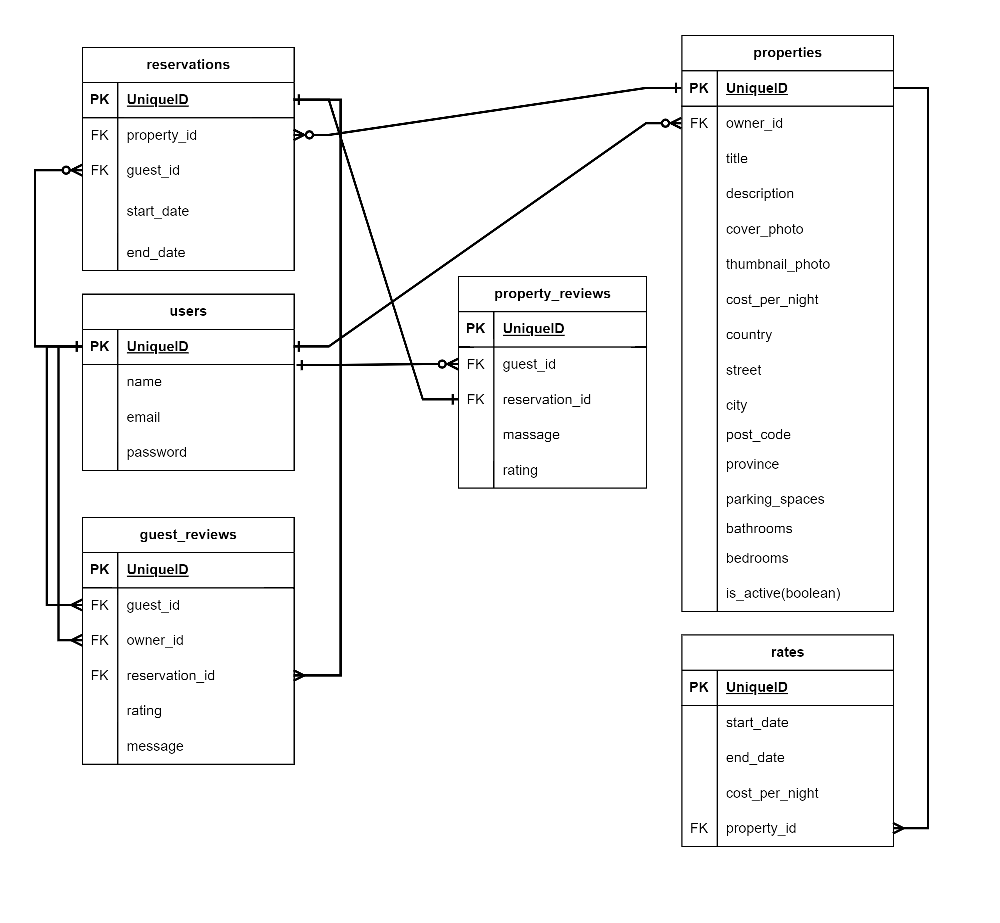

# LightBnB
We build a simple AirBnB clone
The project's main objective is to design a database and use server-side JavaScript to display information from queries to web pages. We use our knowlege of complex SQL queries, database design, and entity relationship diagrams to integrate the database with a Node backend.
___
**Getting Started**

* Clone the repo to your local machine
git clone 
`https://github.com/mr-Arturio/LightBnB.git`
* Navigate to the project directory
  * `cd lightbnb`
  * `cd LightBnB_WebApp`
* Install the required dependencies
`npm install`
* Start the application
`npm run local`
* Run application in a web browser at:Open  http://localhost:3000.


## Project Structure

```
.
├── db
│   ├── json
│   ├── database.js
|   └── index.js
├── docs
├── public
│   ├── javascript
│   │   ├── components 
│   │   │   ├── header.js
│   │   │   ├── login_form.js
│   │   │   ├── new_property_form.js
│   │   │   ├── property_listing.js
│   │   │   ├── property_listings.js
│   │   │   ├── search_form.js
│   │   │   └── signup_form.js
│   │   ├── libraries
│   │   ├── index.js
│   │   ├── network.js
│   │   └── views_manager.js
│   ├── styles
│   │   ├── main.css
│   │   └── main.css.map
│   └── index.html
├── routes
│   ├── apiRoutes.js
│   └── userRoutes.js
├── styles  
│   ├── _forms.scss
│   ├── _header.scss
│   ├── _property-listings.scss
│   └── main.scss
├── .gitignore
├── package-lock.json
├── package.json
├── README.md
└── server.js
```

* `db` contains all the database interaction code.
  * `json` is a directory that contains a bunch of dummy data in `.json` files.
  * `database.js` is responsible for all queries to the database. It doesn't currently connect to any database, all it does is return data from `.json` files.
  * `index.js` used to create a connection pool to a PostgreSQL database. 
* `docs` contains all additional files like pictures, screenshots, diagrams.
* `public` contains all of the HTML, CSS, and client side JavaScript. 
  * `index.html` is the entry point to the application. It's the only html page because this is a single page application.
  * `javascript` contains all of the client side javascript files.
    * `index.js` starts up the application by rendering the listings.
    * `network.js` manages all ajax requests to the server.
    * `views_manager.js` manages which components appear on screen.
    * `components` contains all of the individual html components. They are all created using jQuery.
* `routes` contains the router files which are responsible for any HTTP requests to `/users/something` or `/api/something`. 
* `styles` contains all of the sass files. 
* `server.js` is the entry point to the application. This connects the routes to the database.


### database Relations Diagram



___
This project was created as a part of educational process at [Lightouse labs](https://www.lighthouselabs.ca/).